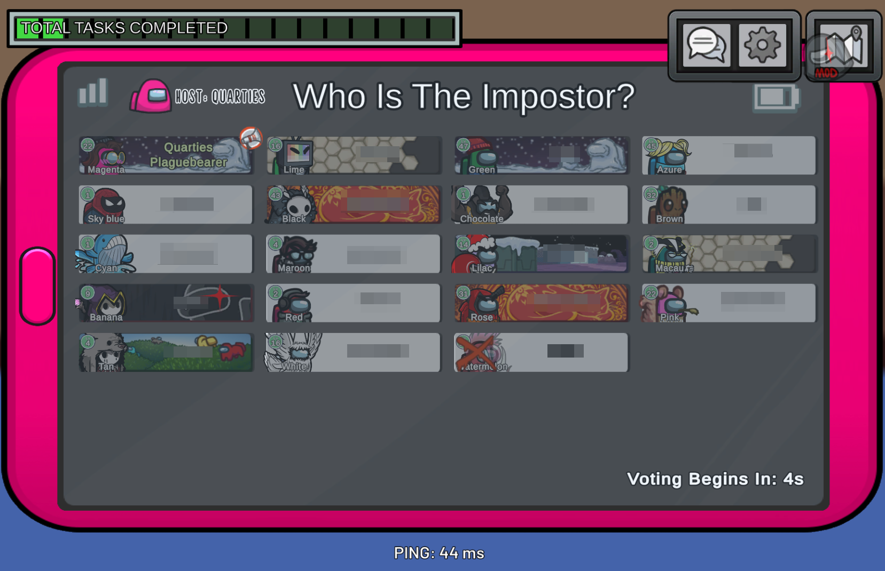

  
  <h1> AleLuduMod </h1>

#

This mod unlocks the possibility to show more than 15 players on screen during an meeting hud, vitals and shapeshifter menu.

> [!Warning]
> AleLuduMod **doesn't** work with official servers from Innersloth. It is recommended to use modded servers.\
> You can create a lobby for up to 127 players, but we recommend limiting it to 32 players in Classic mode. This does not apply to HideNSeek mode.

## Presentation

## Versions

| Mod Version | Among Us - Version | Downloads                                                                                       |
|-------------|--------------------|-------------------------------------------------------------------------------------------------|
| v1.1.3      | 17.0.0 - 17.4.0    | [Download](https://github.com/townofus-pl/AleLuduMod/releases/download/v1.1.3/AleLuduMod.dll)   |
| v1.1.2      | 17.0.0 - 17.2.2    | [Download](https://github.com/townofus-pl/AleLuduMod/releases/download/v1.1.2/AleLuduMod.dll)	 |
| v1.1.1      | 17.0.0 - 17.2.1    | [Download](https://github.com/raspberrygitq/AleLuduMod/releases/download/v1.1.1/AleLuduMod.dll) |
| v1.1.0      | 16.0.0 - 16.1.0    | [Download](https://github.com/raspberrygitq/AleLuduMod/releases/download/v1.1.0/AleLuduMod.dll) |

## Installation

Drop `AleLuduMod.dll` in the **`BepInEx\plugins`** folder with other mods or download the zip package.

> [!Warning]
> The mod needs [BepInEx](https://builds.bepinex.dev/projects/bepinex_be) and [Reactor](https://github.com/nuclearpowered/reactor) to work properly.\
> While **BepInEx** is used by every mod and shouldn't be a problem, without **Reactor** you can't launch the mod.

## Mod Compatibility

AleLuduMod should be compatible with most mods that don't significantly alter interface in the **Meeting / Vitals / Shapeshifter Menu**.

> [!Caution]
> CrowdedMod is **incompatible**.\
> Overloaded is **incompatible**.

## Authors

- [TownOfUs.pl](https://townofus.pl/)
- OrzechMC
- Bubeu
- gitq
- Atony

## Credits

- [CrowdedMods](https://github.com/CrowdedMods/CrowdedMod) - current authors of CrowdedMod that we used as a base for our mod
- [100-player-mod](https://github.com/andry08/100-player-mod) - original author of the CrowdedMod plugin (andry08)
- [MiraAPI](https://github.com/All-Of-Us-Mods/MiraAPI) - code was used to patch ServerDropdown
- [Overloaded](https://github.com/All-Of-Us-Mods/Overloaded) - code was used to improve the game creation menu (Better Capacity Feature)

#
This mod is not affiliated with Among Us or Innersloth LLC, and the content contained therein is not endorsed or otherwise sponsored by Innersloth LLC. Portions of the materials contained herein are property of Innersloth LLC.

© Innersloth LLC.

